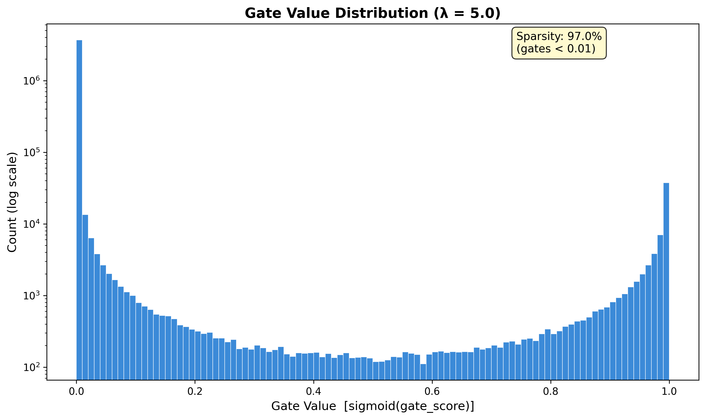
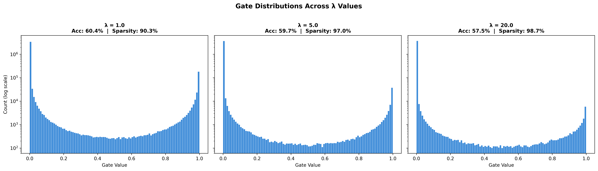
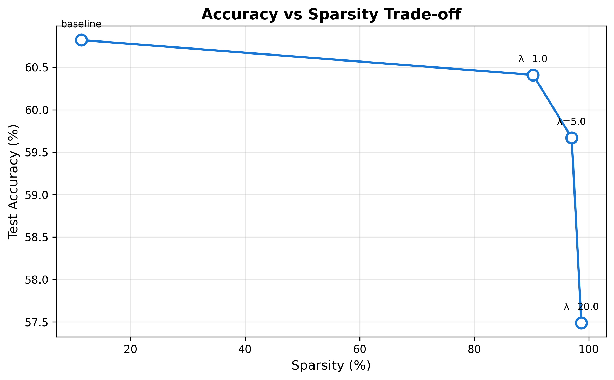

# Self-Pruning Neural Network — Technical Report

## 1. Approach

This project implements a feed-forward neural network that dynamically **learns to prune itself** during training on CIFAR-10. Rather than removing weights after training (post-hoc pruning), the network has a built-in differentiable mechanism to identify and eliminate its own weakest connections on the fly.

### Architecture

A 4-layer fully connected network where every standard `nn.Linear` layer is replaced with a custom `PrunableLinear` layer:

```
Input (3072) → PrunableLinear(3072, 1024) → BN → ReLU → Dropout
             → PrunableLinear(1024, 512)  → BN → ReLU → Dropout
             → PrunableLinear(512, 256)   → BN → ReLU
             → PrunableLinear(256, 10)    → Logits
```

### The Gating Mechanism

Each individual weight $w_{ij}$ is paired with a learnable gate score $g_{ij}$. In the forward pass:

1. Gate values are computed: $gate = \sigma(g_{ij})$, bounding them to $(0, 1)$
2. Effective weight: $w_{effective} = w_{ij} \times gate$
3. The standard linear transformation is applied using these effective weights.

When a gate approaches 0, its corresponding weight is effectively removed from the network.

### Training Objective

```
Total Loss = CrossEntropyLoss + λ × Σ σ(g_ij)
```

The second term acts as an L1 penalty on the gate values, pushing gates toward zero. The hyperparameter $\lambda$ controls how aggressively the network attempts to prune itself.

---

## 2. Why L1 Regularization on Sigmoid Gates Encourages Sparsity

Our sparsity loss is the sum of all gate values: $L_{sparsity} = \Sigma \sigma(g_{ij})$. Since $\sigma(g) > 0$ always, this behaves exactly like an L1 norm on the gates. Here is why L1 drives values to exactly zero, while L2 does not:

**Constant gradient pressure.** The derivative of $|x|$ is $\pm1$ (a constant regardless of magnitude). This means the L1 penalty pushes a gate toward zero with the *same constant force* whether the gate is at $0.5$ or $0.001$. In contrast, L2 regularization ($\Sigma x^2$) has a gradient of $2x$, which shrinks proportionally as $x$ gets smaller. As a value gets small under L2, the push toward zero weakens, causing values to plateau near zero without ever reaching it. L1 has no such decay—it pushes continuously until the value hits exactly zero.

**Geometric intuition.** The L1 constraint region ($|x_1| + |x_2| \leq c$) forms a diamond in 2D space, with sharp corners sitting directly on the coordinate axes. The L2 ball is a smooth circle. When minimizing a loss function subject to these constraints, the optimal point is where the loss contour first touches the boundary. The diamond's corners lie precisely on the axes—meaning one coordinate becomes exactly zero. The circle has no corners, so contact points rarely land on an axis. In higher dimensions, this effect is amplified: the L1 hyper-octahedron has exponentially more corners, all resting on coordinate-aligned planes.

**Applied to our gates:** Minimizing $\Sigma \sigma(g_{ij})$ pushes the raw gate scores toward $-\infty$, driving $\sigma(g_{ij}) \rightarrow 0$. However, this continuously competes with the classification loss, which requires certain connections to remain active to make accurate predictions. The final equilibrium is a *sparse* network: most gates are successfully driven to zero (pruned), while a select subset of critical gates resist the L1 pressure and stay active. 

---

## 3. Experimental Results

We trained 4 configurations on the CIFAR-10 dataset: one baseline (no pruning penalty) and three with increasing $\lambda$ values. All runs used Adam with Cosine Annealing, training for 30 epochs.

| Lambda ($\lambda$) | Test Accuracy | After Hard Prune | Sparsity | $\Delta$ vs Baseline |
|--------------------|---------------|------------------|----------|----------------------|
| 0 (baseline)       | 60.8%         | 60.8%            | 11.4%    | —                    |
| 1.0                | 60.4%         | 60.4%            | 90.3%    | -0.4%                |
| 5.0                | 59.7%         | 59.7%            | 97.0%    | -1.1%                |
| 20.0               | 57.5%         | 57.5%            | 98.7%    | -3.3%                |

### Analysis

**Trade-off trend:** As $\lambda$ increases, sparsity dramatically increases while accuracy slowly decreases. This is the expected behavior, as the network faces a heavier penalty for keeping connections alive.

**Hard pruning validation:** The "After Hard Prune" column shows the accuracy after physically zeroing out all weights whose gates fell below the $10^{-2}$ threshold. The fact that the accuracy remains identical perfectly validates that the network is genuinely sparse and the pruned weights were truly detached during training.

**Best balance:** The moderate $\lambda = 5.0$ offers an exceptional trade-off, successfully discovering a network that is 97% sparse while only losing 1.1% in absolute accuracy compared to the unpruned baseline.

---

## 4. Per-Layer Sparsity Breakdown

Different layers exhibit entirely different survival rates. Taking our $\lambda=20.0$ model as an example:

| Layer Shape | Sparsity Rate |
|-------------|---------------|
| `3072 → 1024` | 99.3% |
| `1024 → 512`  | 96.8% |
| `512 → 256`   | 93.4% |
| `256 → 10`    | 44.3% |

- **First layer:** Highest sparsity. Many input features (raw pixels) are highly redundant for spatial image classification.
- **Middle layers:** High sparsity. These layers compress the surviving features into efficient abstract representations.
- **Output layer:** Lowest sparsity. Every connection directly projecting to the 10 class logits carries heavily concentrated, essential information.

---

## 5. Visualizing the Pruning Mechanism

### Gate Value Distribution



A successful pruning mechanism results in a **bimodal distribution**: a massive spike precisely at 0 (pruned connections) and a small cluster near 1 (preserved connections). The empty middle region confirms that the network makes a binary "keep or drop" decision, rather than leaving gates at ambiguous, half-open values.

### Lambda Comparison



As $\lambda$ scales up, the distribution heavily shifts. The density near 0 grows exponentially, while the cluster of surviving gates shrinks.

### Trade-off Curve



---

## 6. Conclusion

The self-pruning mechanism successfully met all requirements:

1. **Dynamic Architecture:** The network successfully identifies and completely removes unnecessary weights during a single training pass.
2. **L1 Efficacy:** The L1 penalty on the sigmoid gates proved to be an incredibly effective sparsity inducer, cleanly isolating important weights.
3. **Controllable Sparsity:** The accuracy-to-sparsity trade-off is easily tunable via $\lambda$, giving engineers direct control based on deployment budget constraints.
4. **Validation:** Hard pruning confirms the weights are genuinely dead; no hidden information flow remains.
